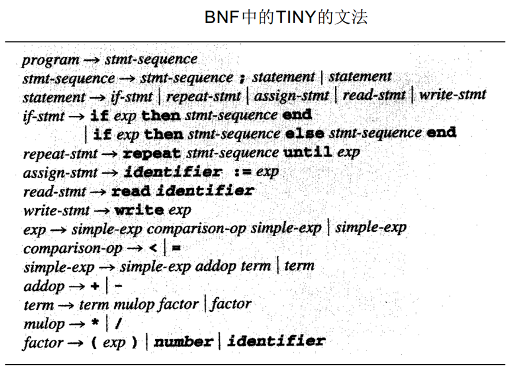
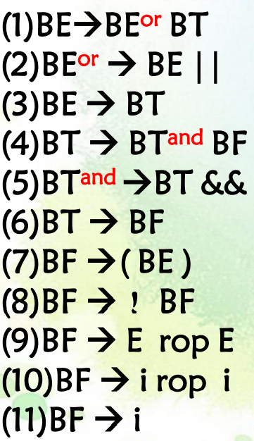
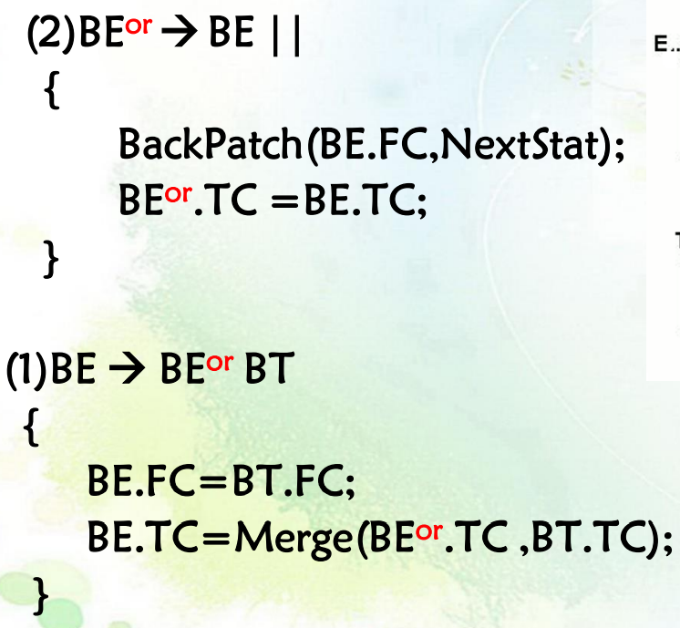
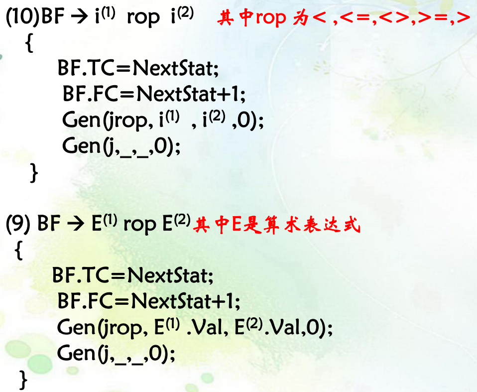

考试要写代码（背啊）

根据给定的形式，写正则表达式or文法

老师上课讲过的全是重点


# 概念chapter1

* 编译过程（全程离不开文字表、符号表、错误处理器）：--源代码-->`扫描程序`--记号-->`语法分析程序`--语法树-->`语义分析程序`--注释树-->`源代码优化程序`--中间代码-->`代码生成器`--目标代码-->`目标代码优化程序`-->目标代码


# 词法分析

## 实验1：词法分析

思路：准备好关键字类型枚举 -> 从文件读取代码 -> 逐个字符扫描 -> 疯狂switch-case -> 判断类型，赋值枚举

# 语法分析

## 实验2：自动机

### 正则表达式

#### 定义

| 单个字符   | a        |  |
| ---------- | -------- | ------------------------------------------------------------ |
| 一元运算符 | ?        |  |
|            | r*       |  |
|            | +        |  |
| 二元运算符 | r\|s     |  |
|            | a(连接)b |  |

#### 示例

标识符letter(letter|digit) *，负整数-(digit) *，浮点数[+|-]?digit+(.digit+)?，十六进制整数-?(digit|[a-f|A-F]) *，

带科学计算的浮点数[+|-]? digit+ . digit * [Ee] [+|-]? digit+

### NFA

Nondeterministic finite automata不确定的有穷自动机。只有一个终点。

```c++
vector<vector<char>> NFA, DFA, minDFA;
```

### DFA

Deterministic Finite Automata确定的有穷自动机。可能有多个终态。

区别：DFA的每一次输入只对应一个结果；而NFA的依次输入可能对应多个结果，形成一个结果集。

【NFA转DFA】**子集构造法**：画出NFA图 -> 画出状态转换表 -> 求出开始结点的ε闭包，填入第一列 -> 根据闭包更新后续的列 -> 求出后续列的闭包 -> 以新的闭包为起点，重复上述步骤，直到没有新的闭包可以填 -> 得到的新状态转换表即为DFA图的表 -> 画出DFA图

```c++
【伪代码：求T的闭包】 
vector<char> count_closure(char t){ 	
    将t状态写入队列中 	
    将closure(t)初始化为T,即需要包含自身状态  	
    while(队列不为空){ 		
        将队首状态t弹出  		
        for(每个从t出发、经过标号为空ε的转换可以到达的u)
            if(u不在closure(T)中){
                将u加入closure(T)中；
                将u插入队列中； 
            }
    }
}
```

```c++
void GetDFA(){
    初始化DFA的表头，列数为NFA.col-1，行数暂定为1
    将闭包count_closure(起始符号)写入队列中
    while(队列不为空){
        将队首闭包C弹出
        if(C不在第一列中){
            将C填入最新行的第一列
            for(闭包中的所有状态t)
                for(每个转移条件x)
                    if(可到达u) { 将u填入DFA中；}  
            求出每一列的闭包count_closure()
            将每一列去重：
    		DFA[currentRow * col + i] = DFA[currentRow * col + i].toList().toSet().toList().toVector();
            将闭包C插入队列中
        }
    }
}
```

【最小化DFA】**Hopcroft算法**：画出DFA图 ->  画出状态转换表 ->合并相同行

```c++
int belongSet(char t){
    int index=0;
    for(auto& set:组集合){
        if(find(t, set.begin(), set.eng()) == true)
            return index;
        index++;
    }
}
```

```c++
void GetminDFA(){
    对于DFA中的每个状态，分为接受状态组（包含NFA终态z）和非接受状态组（不包含z），记录在组集合vector<vector<char>>中
	bool flag = true; //对于当前每一组进行划分 
	while(flag){ 
        flag = 0; 
        vector<vector<char>> newset记录不同组别Q对应产生的新组 
        for(对于每一个转移条件x){
            for(对于当前组中的所有状态t){
                if(可到达){
                    if(t为组内第一个状态) { n1 = belongSet(t) }
                    else if(belongSet(t) != n1){
                        flag = 1;
                        将t从第n1个状态组中删除
                        将t加入到belongSet(t)对应的新组中
                    }	
                }	 
            } 
        }
        将newset中不为空的组并入旧组 
        当前minDFA状态数目等于原本状态数目+新状态数目
	}
	划分结束，构造状态转换表
}
```

## 实验3：文法规则

### 文法

文法是描述语言语法结构的一系列形式规则。

文法的定义形式是一个四元组G=（VN非终结符的集合，VT终结符的集合，P产生式的集合，S开始符号）。

存储结构：

```c++
struct Rule{
	int leftChar;
	vector<int> rightChar;
};
list<Rule> grammar;         // 文法规则
map<int, char> v;           // 字典映射表,0~99是非终结符，100~199是终结符，其中[0]=开始符号S,[100]=ε,[101]=$
int vn,vt;					// 记录字符最大序号
int temp_set[200];          // 算法中多次用到并查集的思想，所以预先分配一个数组
// 首先要保证输入的文法是按左部有序排列的
```

>Tiny语言
>
>

#### 分类、关系

| 0型文法/递归可枚举文法       | 左边至少有一个非终结符                                       | 图灵机         |
| ---------------------------- | ------------------------------------------------------------ | -------------- |
| 1型文法<br />/上下文有关文法 | 左边至少有一个非终结符；右边不含有开始符号S，且长度必须大于左边（例外) | 线性限界自动机 |
| 2型文法<br />/上下文无关文法 | 左边都是非终结符；右边任意（A->a，AB->A）                    | 下推自动机     |
| **3型文法**<br />/正则文法   | 规则的左部都单一非终结符号；右边最多有二个字符。如果有二个字符必须是（终结符+非终结符）的格式；如果是一个字符，那么必须是终结符。 | 有穷状态自动机 |

> 左线性文法：A  ->Bα 或 A  ->α
>
> 右线性文法：A  ->αB 或 A  ->α

#### 推导、规约、分析树、语法树

最左推导=最右规约，最右推导（规范推导）=最左规约（规范规约）

#### 文法二义性

验证：能够画出两颗不同的分析树

消除：①增加约束

### 化简

#### 有害规则

定义：导致文法出现二义性的规则。例如A->A，B->B。

```c++
for(每条文法){
    if(右部长度为1 && 左部符号==右部符号){
        it = grammar.erase(it);
    }
}
```

#### 多余规则

定义：文法中任何句子的推导都不会用到的规则

##### 不可到达规则

将S放入“可到达集合”中。从S开始遍历每个文法，若左部在集合中，则将右部的每个非终结符也放入“可到达集合”中。再次遍历每个文法，若左部不在集合中，则删去。【并查集】

```c++
bool RemoveUnreachableRules(int vn){
    temp_set[0]=1; 将左部开始符号放入集合中
    for(每条文法){
        if(temp_set[左部]==1)
            for(右部每个符号)
                if(是非终结符号) { temp_set[右部]==1; }
    for(每条文法)
        if(temp_set[左部]==0) {it = grammar.erase(it); it--;}
}
```

##### 不可终止规则

【深度优先搜索】【递归】

①从开始符号为左部起步，遍历其对应的每个文法。设当前左部符号为A，检查是否满足A->αAβ形式。

②若满足，则标记该文法，查找以A为左部、可终止的文法。若不存在可终止，则删除所有以A为左部，或右部含有A的文法，返回。

③若不满足，且右部存在非终结符B，则以B为左部重复步骤①②。

```c++
bool RemoveUnterminableRules_sub(int vn, int depth){
    if(depth>5) return fasle;
    for(每条文法){
        if(左部==vn && 右部有非终结符){
            tag = true;
            if(非终结符是vn)	 { 判为不可终止 }
            else			{ endable = RemoveUnterminableRules_sub(其它非终结符, depth + 1);}
        }
        else if(tag)	{ 结束遍历 }
    }
    temp_set[vn] = endable && tag;
    return endable;
}
```

### First集合

定义：可以从**非**终结符号或符号串X**推导出**的所有串首**终结符**构成的**集合**。如果X->∗ε，那么 ε也在FIRST（X）中。举例：


手工算法：以X为目标，从右部符号串取第一个字符a，若a是终结符或ε，则填入Follow集中；若a是非终结符，则继续重复上述步骤，以a为左部，向右推导，直到其右部符号串的**串首**是终结符或ε。

```c++
void GetFirst(int x){
    for(每条文法 && 左部为x){
        if(文法右部的第一个字符a是终结符)	  { 去重，a加入first集 }
        else if(a是非终结符&&a!=x)		{ 递归，GetFirst(a); } 
    }
}
```

### Follow集合

给定一个在右部的非终结符A，则Follow(A)为**紧跟**在其后的每个**终结符号**或（右端结束标记）的**集合**。举例：

| Follow(E)={ , ) }  Follow(E’)={ , ) }  Follow(T)=  { +, , ) }  Follow(T’)=  { +, , ) }  Follow(F)=  { *, +, , ) } |      |      |
| ------------------------------------------------------------ | ---- | ---- |
|                                                              |      |      |
|                                                              |      |      |

| S→ABc  <br />A→a\|ε <br /> B→b\|ε                            |                                                              | S→AB  <br />S→bC  <br />A→ε  <br />A→b  <br />B→ε  <br />B→aD  <br />C→AD  <br />C→b  <br />D→aS  <br />D→c |
| ------------------------------------------------------------ | ------------------------------------------------------------ | ------------------------------------------------------------ |
| Follow(E)={ \$, ) }<br/>Follow(E’)={ \$, ) }<br/>Follow(T)=<br/>{ +, \$, ) }<br/>Follow(T’)=<br/>{ +, \$, ) }<br/>Follow(F)=<br/>{ *, +, \$, ) } | Follow（S）=  ｛＃｝ <br /> Follow（A）=  ｛b，c｝  <br />Follow（B）=  ｛c｝ | FOLLOW(S)={ \$ }<br/>FOLLOW(A)= { a, \$, c }<br/>FOLLOW(B)= { \$ }<br/>FOLLOW(C)={ \$ }<br/>FOLLOW(D)={ $ } |
| (来源：[编译原理中Follow集的求法_杨博东的博客的博客-CSDN博客_follow集](https://blog.csdn.net/yangbodong22011/article/details/52950436?utm_medium=distribute.pc_relevant.none-task-blog-2~default~baidujs_baidulandingword~default-0-52950436-blog-106379883.pc_relevant_recovery_v2&spm=1001.2101.3001.4242.1&utm_relevant_index=3)) | （来源：[编译原理 First集 Follow集 select集 通俗易懂的讲解 +   实例_CooperNiu的博客-CSDN博客_select集](https://blog.csdn.net/CooperNiu/article/details/78524688?spm=1001.2101.3001.6650.6&utm_medium=distribute.pc_relevant.none-task-blog-2~default~BlogCommendFromBaidu~Rate-6-78524688-blog-115911002.pc_relevant_aa2&depth_1-utm_source=distribute.pc_relevant.none-task-blog-2~default~BlogCommendFromBaidu~Rate-6-78524688-blog-115911002.pc_relevant_aa2&utm_relevant_index=7)） | （来源：[判断LL(1)文法（first集、follow集、select集）内存不足°的博客-CSDN博客判断ll(1)文法](https://blog.csdn.net/qq_44922497/article/details/111880076?utm_medium=distribute.pc_relevant.none-task-blog-2~default~baidujs_baidulandingword~default-4-111880076-blog-78524688.pc_relevant_recovery_v2&spm=1001.2101.3001.4242.3&utm_relevant_index=7)） |

遍历每条文法，不断应用下面的规则，直到再没有新的终结符号可以被加入到任意的follow集合中为止：

①当`S是文法的开始符号`时，将 **$** 放到follow（S）中

②当`B是最右部`时，将 **$** 加入到follow(B)中

③如果存在一个产生式A→α**B**β，那么follow（B）**包含first（β）-ε**。（ follow(B)是求跟在B后的终结符或$组成的集合，因此对于跟在B后的β，它的first集合就是follow(B)的子集 ）

④如果存在一个产生式A→α**B**，或存在产生式A→αBβ且first（sβ）包含ε，那么follow（B）**包含follow(A)**。（对于A→αBβ,且β多步推导出ε ，那么可以用αB替换A, B后面紧跟的字符就是A后面紧跟的字符）

### 左公因子

定义：一个或多个文法规则共享一个通用前缀串。

> 举例：A->ab，A->ac。B->acmm，B->acd。

提取左公因子，将后缀改为`左部符号’`，并新增文法：左部符号’->后缀

> 举例（承接上面的例子）：A->aA’，A’ ->b | c。B->acB’，B’ ->mm | d。

```c++
void RemoveLeftCommonFactor(){
    list<list<Rule>::iterator> leftEqual2i;// 左部相同的所有文法
    int i = 0;
    for(每条文法){
        if(左部为i){记录所有左部为vi的文法,插入链表中}
        else{    //左部为vi的文法遍历结束
            if(链表长度!=1){
                /*--------------------------------------------------------------*/
                定义first集字典map<list<int>, int> m，序号n=0，标记tag=false
                for(链表中所有左部为vi的文法){
                    获取右部第一个字符的first集,记为f
                    if(m[f]==0){记录f}
                    else{
                        tag=true;//存在左公因子
                        temp_set[n] = m[f];
                        temp_set[m[f]] = -1;
                    }
                    n++;
                }
                if(tag)
                    for(链表中所有左部为vi的文法)
                        if(temp_set[k]=-1){
                            新增文法C->B
                            把文法文法A->aB改为文法A->aC
                        }
                        else if(temp_set[k]!=0)
                            将文法A->aB修改为文法C->B（移除a，把A改成C）
                /*--------------------------------------------------------------*/
            }
            i=当前文法的左部
            清空链表
            把当前文法插入链表
        }
    }
}
```

### 左递归

定义：文法经过一次或多次推导之后，出现如下形式A->Aα，则称该文法是左递归的。左递归会产生回溯。

①直接左递归：经过一次推导就可以看出文法存在左递归。如A->Aα|β。递归结果为A->Aα->Aαα->Aααα（总在左边增加α）->βααα= β{α}

②间接左递归：需多次推导才可以看出文法存在左递归。如文法：S->Qc | c，Q->Rb | b，R->Sa | a，有S->Qc->Rbc->Sabc。

算法：

①消除直接左递归：

举一个最简单的例子，把A->Aa | β直接改为A->βA’，A’ ->aA’ | ε（右递归）。

更一般化的形如P→P **X**|**Y**（其中X和Y看作一个整体，比如：P→ Pabc|ab|b，X就是abc，Y就是ab|b），可改写为P->**Y**P'，P'->**X**P' | **ε**。

②消除间接左递归：

1）若消除过程中出现了直接左递归，则按照左递归的方法直接消除

2）将消除直接左递归后的新文法代入未解决的文法中（即间接左递归），得到新的直接左递归，按照步骤1再次消除

3）反复实施，直到不可代入

    

```c++
void RemoveLeftRecursion(){
    vector<vector<int>> rule_right;// 以非终结符号Vni为左部的 文法 的右部
    vector<int> temp_right;
    list<list<Rule>::iterator> leftEqual2i;// 左部相同的所有文法
    int i = 0;
    for(每条文法){
    	if(左部为i){记录所有左部为vi的文法,插入链表中}
    	else{    //左部为vi的文法遍历结束
            /*--------------------------------------------------------------*/
            for(链表中所有左部为vi的文法){
                temp_right.clear();
                for(遍历右部){
                    if(非终结符号Vnj在Vni之前) { 将以Vnj为左部的文法代入到形式为Vni→αVnj β的文法中 }
                    else					{ 照抄 } 
                }
                更新右部
            }
            for(链表中所有左部为vi的文法){
                if(存在形式为A->AX的文法){
                    tag=true;//存在左递归
                    新增非终结符B; 新增文法B->ε;
                    将文法A->AX修改为文法B->XB;
                    for(以Vni为左部的文法) { 将B追加到最右部 } 
                }
            }
            rule_right.push_back((*leftEqual2i.front())->right);    
            /*--------------------------------------------------------------*/
        }
    }
}
```

### 生成自动机


| 左线性文法                                                   | 右线性文法                                                   |
| ------------------------------------------------------------ | ------------------------------------------------------------ |
|  |  |

# 语义分析

## chapter4：自顶向下分析

定义：从文法开始符号S开始，不断利用文法规则进行推导，直到推导出所要分析的符号串为止。

### 带回溯的（不确定的）

右部存在左公因子，则逐个右部试探再回溯，直到都不成功，才判断输入有误。

问题：①回溯导致效率低，②左公因子导致左递归和死递归

### 无回溯的（预测性的）

必须同时满足：①无左递归，②无回溯性  ->  **消除左递归**

```c++
exp->term { addop exp  }
term-> factor { mulop term }
```

#### 递归子程序法/递归下降法（实验4：Tiny语言扩充）

```c++
enum TokenID {···}
```

```c++
struct TokenStru { TokenID ID;		int num;		string word; } token;
```

```c++
char buffer[255];
int pos=0;
```

递归下降分析器由一个主程序main和每个非终结符对应的递归函数组成。

```c++
int main(){
    cin.getline(buffer,255);
    pos=0;
    GetToken();
    BTreeNode* root = program();
    return 0;
}
```

* 函数getToken()负责读入下一个TOKEN单词

  ```
  通过switch-case判断token的类型并赋值
  ```

* 函数ERROR()负责报告语法错误

* 函数match()终结符号的匹配处理

  ```c++
  void match(TokenID expecttokenid){
      if (token.ID == expecttokenid)
          GetToken();
      else
          error();
  }
  ```

* 全局变量TOKEN存放已读入的TOKEN单词，TOKEN也可以安排为函数引用参数变量

* 计算算数表达式：语义函数返回值为算数值

* 生成语法树：语义函数返回值为树结点

  ```c++
  struct BTreeNode{
      TokenStru data;
      BTreeNode* lc, * rc;
      BTreeNode(TokenStru d) { data = d; lc = rc = 0; }// 构造函数
      BTreeNode(){}
  };
  ```

* 生成四元组：

  ```c++
  struct Quad{
      string op;
      int addr1, addr2, addr3;
  };
  ```


遇到终结符号做匹配，非终结符号做函数调用。根据**语法图**设计程序。

| 结构                             | 举例                      | 语法图                                                       |
| -------------------------------- | ------------------------- | ------------------------------------------------------------ |
| 重复                             | A -> {B}                  |  |
| 可选                             | A -> [B]                  |  |
| 非终结符：矩形<br />终结符：椭圆 | factor -> (exp) \| number |  |

如何实现算术计算？如何生成语法树？如何生成汇编指令？

> - `BNF` 是最原始，最简单的方法，主要用于理论背景的学术论文中，以与人类进行交流。（与在编译器/解析器中使用相反）。BNF 没有确切的规范。
> - `EBNF` 是 `Extended BNF` （扩展的BNF）的缩写。没有一个标准的 EBNF，因为每个作者或程序都定义了自己的稍有不同的 EBNF 变体。
> - `ABNF` 是 `augmented BNF`（增强型BNF）的缩写，ABNF 的语法与 BNF 完全不同，但是更加标准化，利于解析器的翻译，但不利于阅读。
>
> `BNF`、`EBNF`、`ABNF` 这三者的表达能力是等效的；它们只是语法上的差异。

#### LL(1)分析法

若BNF文法是LL(1)文法，则同时满足以下**条件**：

①对于相同的左部，其右部的first集都没有交集；

②若每个非终结符A的first集都包含了ε，则first(A)∩follow(A) = Ø。【消除文法二义性】

构造LL(1)**分析表**M[N, T]，步骤：

1)对于First(a)中的每个记号a，都将A->a添加到项目M[A,a]中。

2)若E在First(a)中，则对于Follow(A)的每个元素a(记号或是$，都将A->a 添加到M[A,a]中。

3)把分析表A中每个未定义元素置为ERROR。通常用空白表示即可

>例：S -> Ab | Bc， A -> aA | dB,  B -> c | e，分析输入串adcb
>
>

## chapter5：自底向上分析

* 不需要消除左递归

```c++
exp -> exp addop term | term
term -> term mulop factor | factor
addop -> + | -
mulop -> * | /
factor -> number
```

* 必须保证开始符号只有一个右部，若不满足，则需要扩充文法

* 要画DFA状态图，要画分析表

  

### LR(0)

存储结构：邻接矩阵，链接表，**分析表**

要求不存在移进-规约冲突和规约-规约冲突。【以此判断是否是LR(0)文法】

> 例子：n+n+n


### SLR(1)

新增判断Follow集，若下一个符号b∈Follow(A)，说明是规约项，则规约；不属于，说明是移进项，则移进。

> s表示移进，r表示规约


* 问题一：移进-归约冲突（移进项和规约项都是Follow集的子集，不知该移进还是规约）

解决方法：遇到这种冲突，只做移进，不做规约

* 问题二：归约-归约冲突（文法1和文法2的Follow集都包含符号b，不知选哪个文法规约）

| 文法                                                         | 化简                                    | 文法扩充                                                     |
| ------------------------------------------------------------ | --------------------------------------- | ------------------------------------------------------------ |
| call-stmt 一>identifier<br />assign-stmt ->var := exp<br />var -> var [ exp ] identifier<br />exp - vari number | S->id \| V:=E<br />V->id<br />E->V \| n | S' ->S<br />S->id<br />S->V:= E<br />V->id<br />E->V<br />E->n |


解决方法1：要求任何两个完整项目A->α和B->β，Follow(A) ∩ Follow(B)为空【以此判断是否是SLR(1)文法】

解决方法2：**SLR(K)**：超前查看K个符号。当k>1时，SLR(k)分析比SLR(1)分析更强大，但由于分析表的大小将按k的指数倍增长，所以它又要复杂许多。

### LR(1)

SLR(1)分析法的缺陷在于构造LR(0)的DFA时**不考虑<u>先行符号</u>**，而在构造分析表的时候才加以考虑。

解决方法3：在构造DFA的时候就超前考虑先行符号（<u>后面跟着什么符号的时候，才能规约出这条规则</u>）。


### LALR(1)

问题：在LR(1)的DFA中，部分状态是一样的，只是先行符号不同。

优化：做压缩，核心一样就合并，先行符号做并集。


> 分析符号串：(a)、a)

LALR(1)在报错之前做了虚假规约，导致出错延迟；而LR(1)出错及时。

# 对源程序的综合

词法、语法与语义分析是对`源程序的分析`，中间代码生成、代码优化、目标代码的生成则属于`对源程序的综合`。

**语义动作**：自底向上分析中，规约时执行的动作。

## chapter6：中间代码表示方法

### 树（中缀表示）

* 运算符号位于两个运算对象中间，如a+b。
* 不利于表达式的计算及目标代码的产生。

### 逆波兰表示（后缀表示）

* 将运算符放在运算对象的后面，如 a+b->ab+，a+b * c -> a b c * +

  | 赋值语句      | 数组     | 条件语句                                                     | 循环语句                                       |
  | ------------- | -------- | ------------------------------------------------------------ | ---------------------------------------------- |
  | a=b * (c+b)   | a[e]     | if(u) S1 else S2                                             | while(m > n ) k=1;                             |
  | a b c b + * = | e a SUBS | u L1 BZ S1 L2 BR S2                                          | L2:<br />m n > L1 BZ k 1 = L2 BR<br />L1:<br/> |
  |               |          | **BZ**为双目运算符，表示当u不成立(为零)时转向标号L1部分继续执行<br/>**L1**表示语句S2开始执行的位置<br/>**BR**为一个单目运算符，表示<u>无条件转向</u>L2部分继续执行<br/>**L2**表示该条件语句下一个语句开始执行的位置 |                                                |

* 表达式中各运算符的出现顺序决定其计算的先后顺序，因此无括号。

* 在后缀表达式与相应的中缀表达式中，运算对象的出现顺序是一致的。

问题1:如何将中缀表示转换成相应的后缀表示。

问题2:如何计算一个后缀表达式的值。

问题3:如何在原文法规则的基础上添加相应的语义函数，以实现中缀表示转换成相应的后缀表示。

#### ①采用自顶向下分析-递归下降分析法

步骤：

| 1. 构造文法                                   | 2. 改造为EBNF                           | 3. 写出递归下降程序                     |
| --------------------------------------------- | --------------------------------------- | --------------------------------------- |
| E->E+T \| T<br />T->T*F \| F<br />F->(E) \| n | E->T{+T}<br />T->F{*F}<br />F->(E) \| n | int main()<br />getToken()<br />match() |

#### ②采用自底向上分析-LR分析法

步骤：

| 1. 构造文法                                   | 2. 画出LR(0)的DFA图，采用SLR(1)分析法                        | 3. 构造语义动作                                     |
| --------------------------------------------- | ------------------------------------------------------------ | --------------------------------------------------- |
| E->E+T \| T<br />T->T*F \| F<br />F->(E) \| i | E'->E<br />E->E+T<br />E->T<br />T->T*F<br />T-> F<br />F->(E)<br />F->i | <br />+进栈<br /><br />*进栈<br /><br /><br />i进栈 |

### 三元组

`(OP,P1, P2)`：其中OP为运算符，P1、P2为运算对象。用三元组的编号来来代表结果保存的位置。

### 四元组

`(OP, P1, P2, T)`：其中OP为运算符，OP1、OP2 为运算对象，T为计算结果的临时暂存变量。

##### 条件判断

1. 将条件判断转换为算数表达式，比如A>B，转换为A-B>0

> BR：无条件转移
>
> BMZ：条件小于等于0时转移
>
> BZ：条件为0时转移
>
> BLZ：条件大于等于0时转移

2. 直接判断

   e+f>g+h 翻译为：

   （1）( +,e ,f , t1 )

   （2）( +,8 ,h ,t2)

   （3）(j>, tl , t2 , ?)

   （4）(j, ，,? )

   >J=：判断P1=P2
   >
   >J<：判断P1<P2
   >
   >J>：判断P1>P2
   >
   >J：不满足时的假出口

3.  !

   与一般直接判断相同，只是真假出口调换。

4. &&

   当四元组n为真出口时，转向n+2；定义<u>假出口链</u>，假出口指向链表的上一结点，最后<u>回填</u>真正的假出口。


5.  ||

   定义真出口链，假出口指向链表的上一结点，最后回填真正的真出口；当四元组n为假出口时，转向n+2。

   ##### 代码编写
   
   | 逻辑表达式文法规则                                           | 改进                                                         |
   | ------------------------------------------------------------ | ------------------------------------------------------------ |
   | BE->BE \|\| BT<br />BE->BT<br />BT->BT && BF<br />BT->BF<br />BF->！BF<br />BF->(BE)<br />BF->E rop E<br />BF->i rop i<br />BF->i |  |
   
   ```c++
   int NextStat = 1;// 全局遍历，指向下一个四元组的编号
   List<Quad> quad;
   void Gen(string op, int addr1, int addr2, int addr3){//生成四元组
       quad.push(Quad(op,addr1,addr2,addr3));
   }
   void BackPatch(P,t);//把以P为链首的四元组链上的每个四元组第四分量都填上t
   List Merge(List P1, List P2){//把以P1,P2为链首的两个四元组链合二为一，返回合并后的链首
       if (P2==0) return P1;//当P2为空(=0)时，则合并后的链首为P1,否则合并后的链首为P2
       else{
   		P=P2;
           while(四元组P的第4个分量不为0)
               P=四元组P的第四个分量内容;
           把P1填入四元组P的第四个分量上;
           return P2;
       }
   }
   ```
   
   ```c++
   ```
   
   
   
   
   
   

$$$$$
